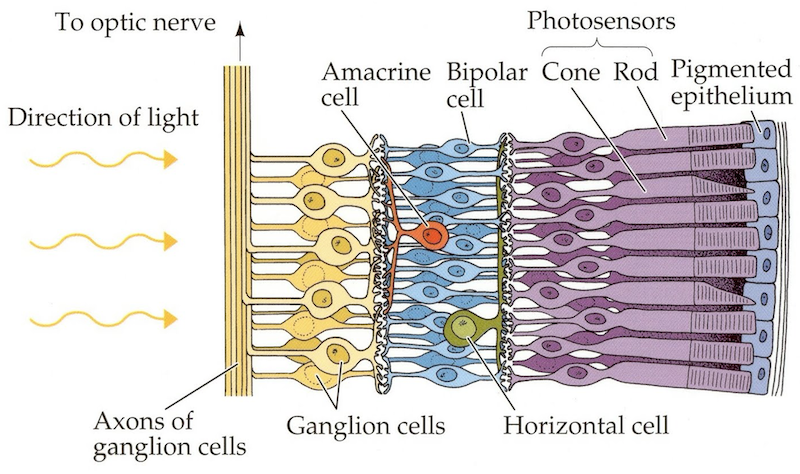
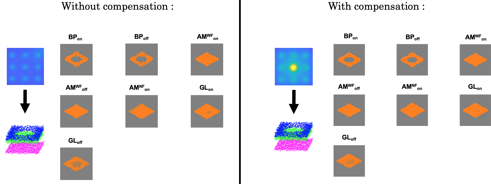

# Modeling Electrical Retinal Stimulation

## Description
This repository describes a research project developed during the Master course *Sensorimotor-Neuroprosthetics (BIOENG-486)* given by Professors Gregoire Courtine and Silvestro Micera at EPFL, in Fall 2021.

> *Note: Our full report is available on this repo. This README gives a short intro and some context to our work.*

## Introduction

### Some context
The retina is the first processing block of human vision. It is a complex system composed of multiple layers of cells including cone photoreceptors (CR), horizontal cells (HRZ), bipolar cells (BP), amacrine cells (AM) and ganglion cells (GL) – see Figure 1 below. However, these cells can be damaged, leading to vision issues and potentially vision loss. It is the case in diseases such as Age-related Macular Degeneration (AMD) and Retinitis Pigmentosa (RP), which are both responsible for the **loss of photoreceptors**, and the main target of our work.

Today, retinal prostheses are promising solutions for vision recovery, but still not developed enough, mainly because of our lack of understanding of the retina. This is why numerical modelling is essential to investigate this complex system and predict the visual experience that retinal implants can provide to patients.

| |
|:--:|
| *Figure 1: Representation of retinal layers. Electrical signals produced by the photoreceptors travel from right to left, are processed in each layer up to the optic nerve through the Ganglion cells axons on the left.*|

### Our proposal

> Our project aimed at combining the aspects of two articles in order to build a hybrid model of retinal stimulation: The first one [[1]](#1) gives a stationary model of the retina using only the layer conductances and computes potential drops coming from the electrodes in space, and the second one [[2]](#2) proposes a spatio-temporal model of individual cells subjects to potential drops using time-dependent differential equations.

In essence, we model the compensation of the loss of photoreceptors in a degenerated retina by a retinal implant: **an electrode array of tunable size and pattern** which stimulate the **Retinal Ganglion cells**, outputting a signal to the brain. Going from the healthy case where light reaches the photoreceptors and provides an image, to the degenerated case where electrodes replace a lost photoreceptors, the ultimate goal that we achieved in this project was to provide an electrical stimulation with a specific compensation current leading to a **perceived image similar to the one obtained with light**.

Our pipeline can be adapted to Sub- and Epi-retinal stimulation, the two most studied and used stimulation methods in research. The target cells to excite are the same for each method: Retinal Ganglion cells.

Our work will hopefully improve retinal prostheses research. Indeed, to the best of our knowledge, **no attempt has been made to combine FEM with a biophysical model of the retinal network that could provide a more complete description of retinal behavior under electrical stimulation**.

## To go deeper

### Stationary geometrical Model

In the first part, we successfully reproduced the design of a retinal model on Comsol Multiphysics and MATLAB proposed by Joarder et al. [[1]](#1).

First, a retinal geometry has been designed with Finite Element Modeling (FEM). Our model of the retina is composed of 9 layers, each having a specific electrical conductivity. We then solved the problem for one electrode only (either epi-retinal or sub-retinal), and superimposed the result to create an electrode array.
Finally, this 3D voltage field is interpolated at the positions of the cell bodies in each layers. We specifically need the voltage gradient at these points, which is called the *Resistive Potential Drop* for each cell.

This FEM part **does not give any time-dependent information**, as we only consider the layers’ conductivity. In order to have time information, we fed the *Resistive Potential Drop* matrix as an input into the next stage to perform spatio-temporal modeling.

### Spatio-temporal model

The second paper, written by Cottaris et al. [[2]](#2), gives differential equations that model the temporal response of each layer of the retina, now considered as collection of individual cells.

We first reproduced the retinal response in the case of a healthy retina stimulated by light, and we managed to reproduce similar responses for a **degenerated retina** with **complete loss of photoreceptors** (Figure 2).

We defined a light stimulation protocol that has been compared with the electrical stimulation. This one consists of applying 4 pulses in time with different levels of contrast between the illuminated area and the surrounding.

|  |
|:--:|
| *Figure 2: Comparison of retinal behavior with and without current compensation at the center of a degenerated retina. Without compensation, GL_off and G_on cells are less excited in the center due to lack of BP cells.*|

## Conclusion

Thanks to our pipeline, we can predict **patient-specific cellular degeneration** compensation by the electrical stimulation of specific electrodes.
Many iterations can be performed with various electrode sizes, shapes and patterns without significant impact on the computational complexity.

> Complete pipeline: The patient retina has to be imaged to map the specific degenerated areas. Then, one can build a numerical model reproducing the patient retina. Finally, our model can be applied onto it, and the parameters (delivered current and the position of the electrode) can be tuned to get the desired output pattern.

## References
<a id="1">[1]</a>
Joarder SA, Abramian M, Suaning GJ, Lovell NH, Dokos S. A continuum model of retinal electrical stimulation. J Neural Eng. 2011 Dec;8(6):066006. doi: 10.1088/1741-2560/8/6/066006. Epub 2011 Oct 26. PMID: 22027346.

<a id="2">[2]</a>
Nicolas P Cottaris and Sylvia D Elfar. How the retinal network reacts to epiretinal stimulation to form the prosthetic visual input to the cortex. Journal of Neural Engineering, 2(1):S74–S90, Feb 2005. doi: 10.1088/ 1741-2560/2/1/010.

## Authors
Victor Amiot, Raphael Ausilio, Andy Bonnetto, Valentin Karam & Tanguy Roche
